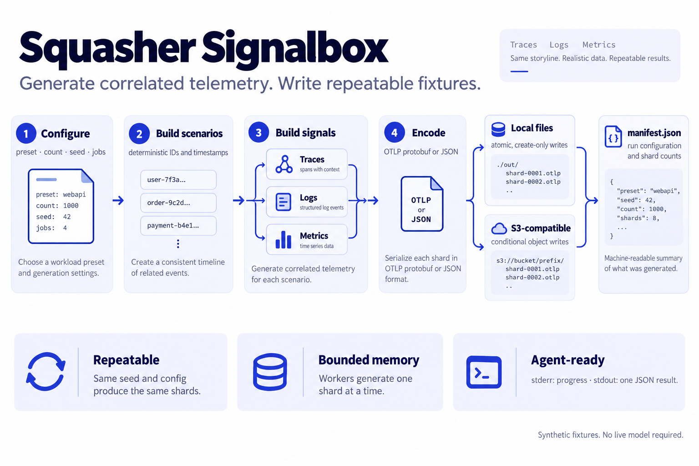
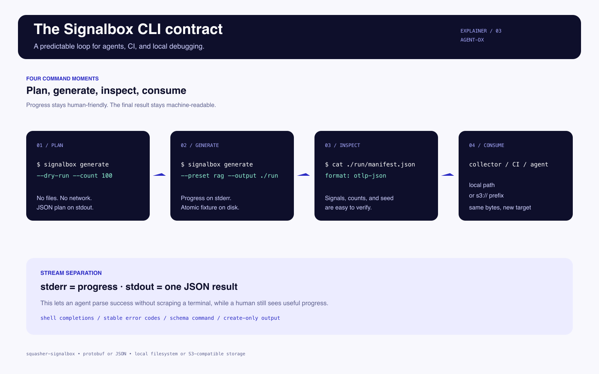

<p align="center">
  
</p>

<h1 align="center">Squasher Signalbox</h1>

<p align="center"><strong>Synthetic agent telemetry for tests you can trust.</strong><br>
Generate. Observe. Squash flaky fixtures.</p>

<p align="center">
  <a href="https://github.com/squasher-ai/signalbox/actions/workflows/ci.yml"></a>
  <a href="LICENSE"></a>
</p>

> Know why production broke. Then squash it.

**Synthetic signals for finding out why production broke.**

Generate repeatable traces, logs, and metrics for agent tests, collector checks, demos, and load work.

Each scenario connects a trace with the logs and metric points that explain it. Generate an agent, RAG, or web flow without hand-writing three separate signal sets.

> Squasher Signalbox is a Squasher open-source project. It is built for synthetic test evidence, so every payload is safe to regenerate and inspect.

## Why Signalbox

Most telemetry generators solve one part of the job. The official Collector `telemetrygen` is a strong endpoint load tool. Agent-focused projects model chat and tool loops. Generic topology generators model services. Signalbox brings the useful parts together for offline fixtures: connected agent scenarios, all three OTLP signals, repeatable bytes, local or S3-compatible output, and a CLI contract that works in an agent or CI job.

Signalbox is designed for test evidence, not production telemetry. It writes synthetic payloads and never needs a live model, prompt, or application.

## Install

Build from source with Rust 1.88 or newer:

```sh
cargo install --path .
signalbox --help
```

You can also run it without installing:

```sh
cargo run --release -- generate --count 10000 --output ./fixture
```

For interactive use, generate shell completion from the installed binary:

```sh
eval "$(signalbox completions zsh)"
```

Use `bash`, `elvish`, `fish`, `powershell`, or `zsh` as the shell name. See [docs/agent-dx.md](docs/agent-dx.md) for the automation output contract.

## Quick start

```sh
# Protobuf (the default), three signals, 1,000 scenarios per shard.
signalbox generate --count 10000 --output ./agent-fixture

# OTLP/JSON for a human-readable fixture.
signalbox generate --preset rag --format json --output ./rag-fixture

# Validate a plan without creating files or contacting S3.
signalbox generate --dry-run --count 100 --output ./preview

# Inspect machine-readable defaults and presets.
signalbox schema > config-schema.json
signalbox presets
```

Use a new local output directory and a new S3 prefix for each run. Local files use create-only writes; S3 objects use conditional writes. A run writes one file per signal and shard plus `manifest.json`:

```
traces-000000000000.otlp.pb
logs-000000000000.otlp.pb
metrics-000000000000.otlp.pb
manifest.json
```

Progress is written to stderr. Stdout contains exactly one JSON plan or summary, which makes the command safe to call from an agent, CI job, or shell pipeline. Use `--progress never` for fully quiet automation. Errors have stable `code` and `message` fields and a non-zero exit status.

## Scenario presets

Every preset produces a connected trace tree and matching signal records. Choose the smallest story that matches the system under test:

| Preset | Shape | Useful for |
| --- | --- | --- |
| `agent` | Agent invocation, model call, and tool call | Agent orchestration and tool policies |
| `rag` | Agent invocation, retrieval, model call, and tool call | Retrieval pipelines and grounded answers |
| `web` | HTTP request and database child | Web request correlation and backend failures |

Use `--signals traces`, `--signals logs`, or `--signals metrics` when a test only needs one signal. The same scenario determines IDs, timestamps, error state, and metric values when multiple signals are enabled.

## S3 and compatible storage

Use the AWS default credential chain and an `s3://bucket/prefix` target:

```sh
AWS_PROFILE=fixtures signalbox generate \
  --output s3://my-bucket/agent-runs/run-001 \
  --region us-east-1
```

For MinIO, LocalStack, or another S3-compatible service, pass a credential-free endpoint and explicit static credentials through environment variables. Signalbox never forwards the default AWS profile or instance credentials to a custom endpoint. It forces path-style addressing and keeps the same create-only guarantee:

```sh
AWS_ACCESS_KEY_ID=minioadmin AWS_SECRET_ACCESS_KEY=minioadmin \
  signalbox generate \
  --output s3://fixtures/agent-runs/run-001 \
  --endpoint http://127.0.0.1:9000 \
  --region us-east-1
```

See [docs/s3-compatible.md](docs/s3-compatible.md) for provider setup and required permissions.

## Design guarantees

- **Connected signals:** trace IDs, span IDs, log IDs, conversation IDs, timestamps, and failures line up across signals.
- **Repeatable:** the same seed and configuration produce byte-identical shards, independent of worker count.
- **Bounded:** workers generate one shard at a time; `jobs * batch_size` is capped at one million scenarios.
- **Parallel by design:** generation is parallel across shards and encoding runs off the async runtime. Benchmark release builds with your scenario and hardware before comparing tools.
- **Create-only output:** output directories must not exist, files use create-only semantics, and S3 uses conditional puts.
- **Agent-ready:** progress and results use separate streams, plans are JSON, schemas are discoverable, and secrets are never included in errors or manifests.

Read [docs/architecture.md](docs/architecture.md) for the execution model, [docs/agent-dx.md](docs/agent-dx.md) for automation contracts, and [docs/performance.md](docs/performance.md) for reproducible benchmarks. See [docs/alternatives.md](docs/alternatives.md) for the comparison with other generators.

## Visual guide

These diagrams show the system shape, the correlated agent story, and the CLI contract:

<p align="center">
  
</p>

<p align="center">
  
</p>

<p align="center">
  
</p>

## OpenTelemetry compatibility

The generator emits OTLP protobuf or OTLP/JSON export requests accepted by the OpenTelemetry Collector. Core attributes use the pinned OpenTelemetry schema URL. Agent and RAG scenarios use the GenAI development schema URL and explicitly identify their pinned upstream commit. GenAI metric names are development conventions and may change upstream; they are not presented as stable API.

The key snapshot and provenance are in [`src/semconv.rs`](src/semconv.rs). See [docs/standards.md](docs/standards.md) for the conventions and links to the upstream registry and [semconv.com](https://semconv.com/).

## Development

```sh
cargo fmt --all -- --check
cargo check --locked
cargo test --locked
cargo clippy --all-targets --all-features -- -D warnings
cargo doc --no-deps --locked
```

Use `cargo run --release -- generate --count 100000 --output ./bench-fixture --progress never` when comparing throughput. Include the command, hardware, Rust version, format, and signal set with benchmark results.

## License

MIT. See [LICENSE](LICENSE).
